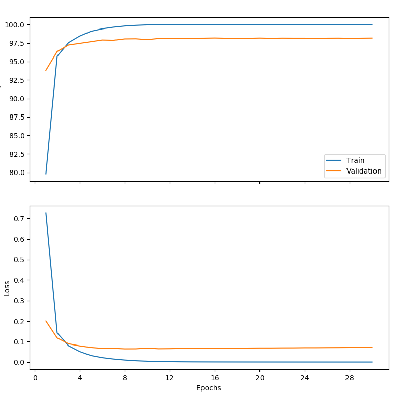

# Question 4
To overfit fully connected feed forward net on MNIST, run:
```
$ python q4.py
```

## Hyperparameters 
- `n_epochs=30`
- `batch_size = 2048`
    - We use large batch size, which is known to cause overfitting ([On Large-Batch Training for Deep Learning](https://arxiv.org/abs/1609.04836))
- `hidden_sizes = [4096]`
    - The feedforward net has only 1 large hidden layer
- `lr = 0.006`
    - constant learning rate for the Adam optimizer

## Training progress



## Result
**After 30 epochs we achive**:
- `train_loss: 0.000203`
- `train_acc: 100%`
- `validation_loss: 0.071842`
- `validation_acc: 98.183334`

## Does it overfit?
Training useful neural network models means making them pick out and learn useful general patterns that can be reapplied.

Overfitting is can be thought of as fitting the training data too well along with the noise, essentially memorizing and including the randomness in the trained model. Memorization doesn't help the generalization though, where by "generalization" we mean the performance on unseen data. The validation/test data will most likely contain differrent random noise to that of the noise present in the training dataset.

In our little experiment we saw, that at some point in the training process the validation accuracy stopped getting better while the training accuracy was still rising, all the way up to 100%. At some point the neural network stopped learning general patterns and only concentrated on memorizing every training example in the dataset.
