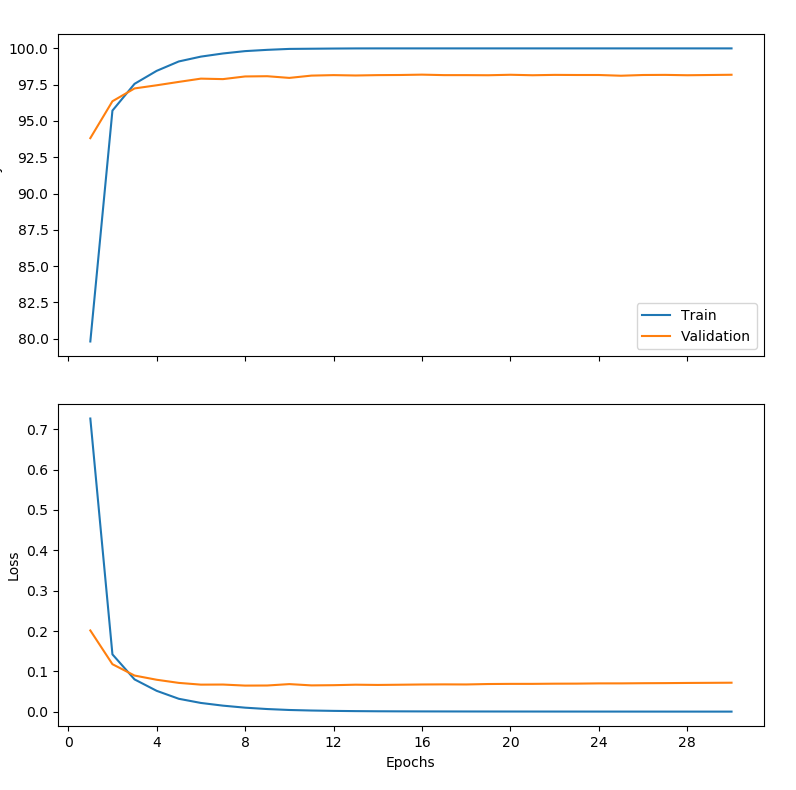
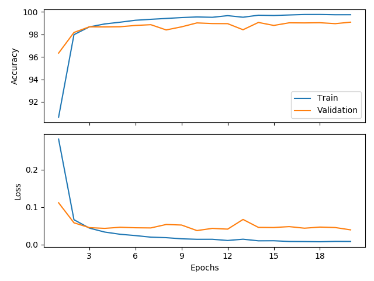
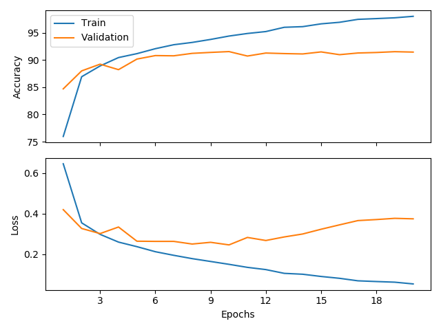

# Question 4
To overfit fully connected feed forward net on MNIST, run:
```
$ python q4.py
```

## Hyperparameters 
- `n_epochs=30`
- `batch_size = 2048`
    - We use large batch size, which is known to cause overfitting ([On Large-Batch Training for Deep Learning](https://arxiv.org/abs/1609.04836))
- `hidden_sizes = [4096]`
    - The feedforward net has only 1 large hidden layer
- `lr = 0.006`
    - constant learning rate for the Adam optimizer

## Training progress



## Result
**After 30 epochs we achive**:
- `train_loss: 0.000203`
- `train_acc: 100%`
- `validation_loss: 0.071842`
- `validation_acc: 98.183334`

# Question 5

## Pretraining
The CNN is more expensive to train than our previous feedforward model. We therefore train it only for 20 epochs.
Loss and accuracy figures and metrics are saved in the "results" directory.

Pretrained model weights are saved in the "pretrained" directory.


### **MNIST**
```
$ python q5_pretrain.py --batch_size 128 --lr 0.001 --n_epoch 20 --dataset mnist
```

#### **Pretraining progress**


### **Fashion-MNIST**
```
$ python q5_pretrain.py --batch_size 128 --lr 0.001 --n_epoch 20 --dataset fashion
```




### Pretraining results
|dataset|train accuracy|test accuracy|
|-|-|-|
|MNIST|99.752%|99.08|
|Fashion-MNIST|98.008%|91.04%|